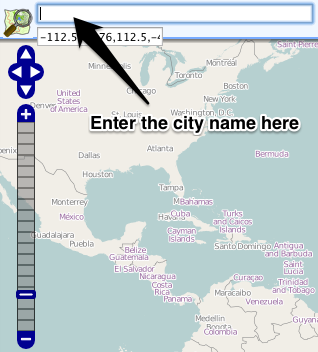
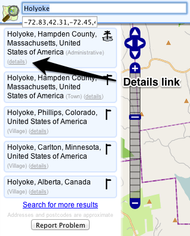
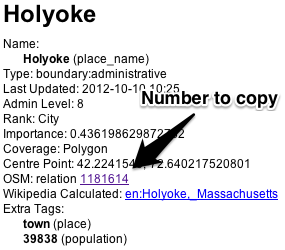
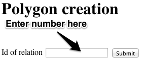
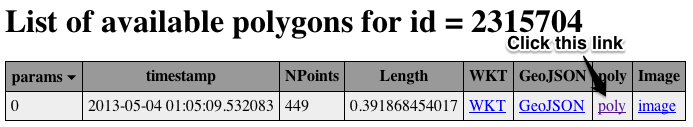

# cities

This is a collection of `.poly` files for cities. The ultimate goal is to have them all, but it's a rough process right now (as explained below)...

These `.poly` files are used to then extract just the city's OSM file from a greater region's OSM file. For example, creating an exact OSM file for Boston from the North America OSM file.

### How To Get The Poly File For A City

Sometimes there won't be a Relation ID for a city, or the Relation that exists will be broken. For those instances, the final OSM file can be created manually by tracing the city at [http://extract.bbbike.org/](http://extract.bbbike.org/) - just make sure you select one of the 'OSM XML' formats in the top pulldown menu there.

* Go to [http://nominatim.openstreetmap.org/](http://nominatim.openstreetmap.org/) and search for the city you'd like added

    
* Click the 'details' link for that city in the left column

    
* Copy the number for 'OSM: relation'

    
* Go to [http://osm102.openstreetmap.fr/~jocelyn/polygons/index.py](http://osm102.openstreetmap.fr/~jocelyn/polygons/index.py), paste the number into the form, and click the Submit button

    
* Click the 'poly' link to open the file in the browser, then use `File -> Save As` to save the file

    

* The naming convention I've been using is `city-name_state-abbreviation.poly`. For example, `holyoke_ma.poly`

### How To Use The Poly File

* Install [Osmosis](http://wiki.openstreetmap.org/wiki/Osmosis)
    * If you're on a Mac, I suggest you use [Homebrew](http://mxcl.github.io/homebrew/) to install it with `brew intsall osmosis`
* Download the OSM file for the region that the city is in from [http://download.geofabrik.de/](http://download.geofabrik.de/)
* Run this to get the city's OSM file out of the state's (country's?) OSM file:
`osmosis --read-pbf-fast file="YOUR-REGION-latest.osm.pbf" --bounding-polygon file="CITY-NAME_STATE.poly" --write-xml file="CITY-NAME_STATE.osm"`
For example:
`osmosis --read-pbf-fast file="north-america-latest.osm.pbf" --bounding-polygon file="holyoke_ma.poly" --write-xml file="holyoke_ma.osm"`
